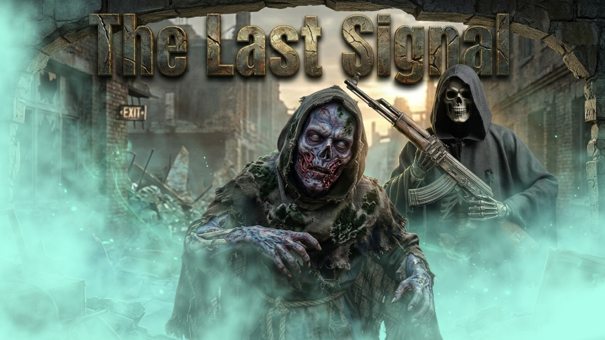

## 📁 SYSTEM MANIFEST | V3.0-POWER-SCALED
ID: SD-V3.0-AUTHORITY-EXTENDED
TIME: 03.03.2026 | 00:00 UTC +1

VALIDATION: 🏃‍♂️ [ 0 ERRORS | 0 WARNINGS ] 🚀

ENGINE: UE 5.7.2 [STABLE / SCALING]

# 🌌 SheychX Dynamics | Project: "The Last Signal"

## 🎮 PROJECT: "THE LAST SIGNAL"
*High-tier vertical mobility meets Eldritch horror and Industrial brutalism.*

### ⚙️ CORE ARCHITECTURE (V3.0-ADVANCED)
> **Build ID:** SD-V3.0 (03.03.2026)

#### 📁 Technical Evolution & Version Log
* **V0.1 – V0.9** (03.02.2026 – 09.02.2026): Initial Prototype Inception and iterative framework testing.
* **V1.0 – V1.9** (11.02.2026 – 17.02.2026): Milestone Expansion and Framework Stabilization.
* **V2.0 – V2.2** (18.02.2026 – 21.02.2026): Architecture Baseline and TLS Integration with Debug Branching.
* **V2.5** (24.02.2026): Establishment of the V2.5 Authority documentation standard.
* **V2.6** (25.02.2026): Integration of the IK-Precision Engine (Translation-Retargeting-Fix for UE 5.7).
* **V2.7** (27.02.2026): HardCrypted IoStore Phase. Implementation of AES-256 asset encryption.
* **V2.8** (28.02.2026): Massive Core optimization.
* **V2.9** (01.03.2026): Core == 0(ZERO) Bug Policy.
* **V3.0** (01.03.2026)(MEZ+1)(23:00): Stable / Ship Debug Dev.
  

> **Philosophy:** "Solve what others fear, Scale what others can't."
> https://www.reddit.com/r/UnrealEngine5/comments/1rft19v/collab_ue_57_performance_project_the_last_signal/

* **IK-Precision Engine:** Proprietary Translation-Retargeting-Fix for UE 5.7. Procedural animations via 'Skeleton' protocol.
* **V3.0 Hybrid AI (The "Lazy AI" Method):** Optimized for high-density encounters using a decoupled logic-tick throttling system.
* **Physical Overlap Overrides:** Instant AI reactivity via physics-based triggers—bypassing idle latency.
* **SD Core Metrics:** Build < 1.0 GB(1k textures) | Project File Size < 5.0 GB | Project Raw File Size < 3.0 GB
* **Debug Build Size THL V2.7:** 2.75 GB 2k textures
* * **Debug Build Size THL V3.0:** <- 1.0 GB(1k textures) Lean State(3 Types of Enemies Included full Character abilities fight/swim/ 3 Rifles 1 Shotgun)
  * * * **Debug Build Size THL V3.0:** <- 3.0 GB (2k textures) 

---

## 🏗️ PERFORMANCE DATA & BENCHMARKS
> **Status:** Architecture allows for playable environments; optimization for consistent 30+ FPS baseline is ongoing.

*Current Arena Stress Test: Validating Architecture V2.7 scaling in standalone shipping environments.*

### 🧪 BENCHMARK PROTOCOL (TEST: 3)
| Metric | Value | Status |
| :--- | :--- | :--- |
| **Active Agents** | 30 - 50 High-Performance Agents | [OPERATIONAL] |
| **Average FPS** | Variable / Playable | [OPTIMIZING] |
| **Hardware Context** | RTX 2070 Mobile | [BASELINE] |
| **Logic Recovery** | < 15ms CPU Response | [VALIDATED] |

### ⚡ Performance & Compatibility
* **Adaptive Build System:** Compiled using .NET 8.0 SDK and MSVC 14.50 for instruction-set efficiency.
* **Modern Containerization:** Utilizing the Zen File Manifest and IoStore architecture for asset streaming.
* **OS Compliance:** Fully validated on Windows 11 (25H2) [Build 10.0.26200].
* **Encryption Standard:** AES-256 HardCrypted asset protection for secured technical logic.

---

## 🛠️ RECRUITMENT & TECHNICAL AUTHORITY
**SheychX Dynamics** is opening strictly limited slots for a disciplined core team. Professionalism is binary.
### 4. RECRUITMENT STATUS (V2.7 - V3.0)

- Map-Builders: 1 Slot (Strict constraint).
- Game Design: 1 Slot (Combat balancing / AI behavior).
- VFX: 1 Slot.
- Animation: 1 Slot.
- Infrastructure: 1 Slot (Discord/Repo).
- Debugging: 2 Slots (QA / Edge-cases).
- Audio: 1 Slot (SFX).

DC @sheychx

